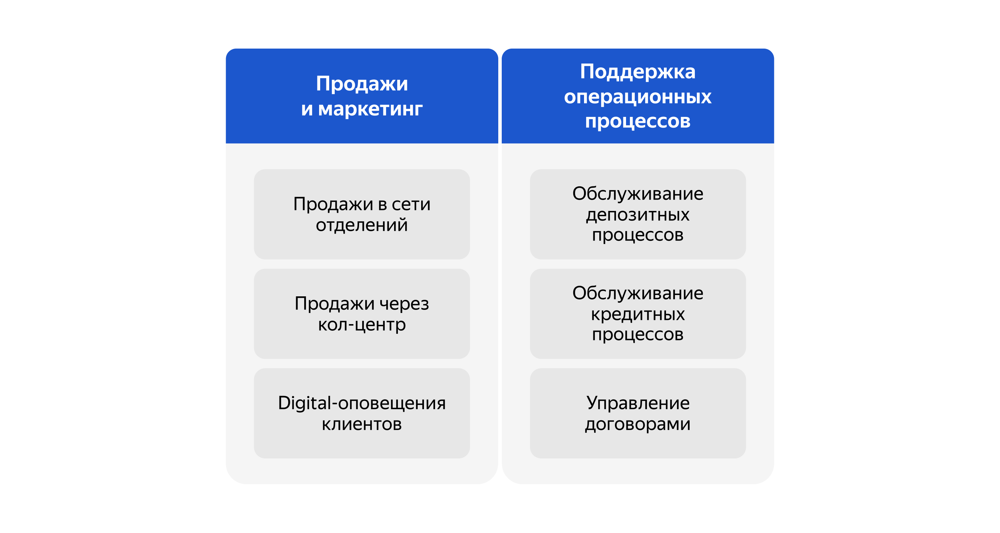

# architecture-standart
_проектная работы 9 спринта_

## Описание кейса

### О компании

«Стандарт» — это небольшой банк. У него есть сайт и интернет-банк, но клиенты редко ими пользуются. Сайт умеет только показывать маркетинговую информацию, а функционал интернет-банка ограничивается проведением платежей и открытием текущих счетов (дебетовых карт).  
      
Основная категория клиентов банка — люди старшего возраста, которые предпочитают офлайн-обслуживание. Именно поэтому онлайн-каналы «Стандарта» развиты так слабо.   
   
Сотрудники в отделениях сейчас работают напрямую с автоматизированной банковской системой (АБС). Это основная система, где производится учёт операций по счетам и бухгалтерия. Чтобы реализовать возможность проведения платежей и открытия текущих счетов, интернет-банк интегрировали с АБС — напрямую с её базой данных.    
   
Сотрудники кол-центра принимают звонки через отдельную систему. Ещё при необходимости компания может подключать партнёрский кол-центр. Он работает по готовым скриптам звонков, которые ему передают бизнес-представители банка.

### Структура компании

Важно понимать, что в банковской системе различают фронт-офис и бэк-офис. Это подразделения, которые работают над разными задачами компании. Менеджеры фронт-офисной системы работают с посетителями. Они несут ответственность за контактирование с людьми, маркетинг и продажи. Менеджеры бэк-офиса отвечают за деятельность компании на финансовых рынках и управление активами и пассивами банка. Они поддерживают внутренние бизнес-процессы, которые не видны клиентам.   
   
В структуре компании «Стандарт» семь основных направлений:
   
- **Управление обслуживанием в сети отделений.** Сюда входят менеджеры фронт-офиса — сотрудники, которые работают в отделениях банка. У «Стандарта» 50 отделений в разных регионах. Там работают 500 человек.
- **Управление IT.** Над интернет-банком работают две команды: внутри банка этим занимается 10 человек и ещё 10 человек работает на стороне подрядчика. Ещё внутри направления есть команда, которая занимается непосредственно АБС — автоматизированной банковской системой. Этот отдел состоит из 20 человек.
- **Управление обслуживанием депозитных продуктов.** Сюда относятся менеджеры бэк-офиса, которые специализируются на депозитах. Всего их 50 человек.
- **Управление обслуживанием кредитных продуктов.** Сюда относятся менеджеры бэк-офиса, которые специализируются на кредитах. Их тоже 50 человек.
- **Кол-центр банка «Стандарт».** В банке работают 200 операторов. Также важно учитывать, что в качестве системы кол-центра банк использует не собственное решение, а платформу подрядчика. На стороне подрядчика выделена команда сопровождения, которая поддерживает и дорабатывает систему. В ней работают пять человек.
- **Партнёрский кол-центр.** Команда партнёрского кол-центра насчитывает 100 человек.
- **Команда цифровой трансформации розничного бизнеса.** В ней 10 человек.

### IT-ландшафт компании

Теперь обратимся к IT-системам компании. Дела обстоят так:
- **Интернет-банк**. Клиент-серверная система на веб-фреймворке ASP.NET MVC 4.5 на основе .NET Framework 4.5 и СУБД MS SQL. Монолит реализован на платформе подрядчика. Команда банка может самостоятельно вносить изменения, но обновление ядра системы привязано к подрядчику. Интернет-банк работает на одной группе серверов в ЦОД. Также есть резервный ЦОД, на который можно переключиться в случае сбоя.
- **Автоматизированная банковская система (АБС).** Интерфейс пользователей — это десктопный клиент на Delphi и СУБД на Oracle. Основная логика работы системы реализована процедурами на PL-SQL в СУБД. Система полностью разрабатывается внутри банка.
- **Система кол-центра.** Это клиент-серверная система на платформе подрядчика, работает на технологиях подрядчика. Сама платформа предназначена для автоматизации CRM-решений, но банк использует только функционал кол-центра. У системы веб-интерфейс на React.js, бэкенд на Java Spring Boot и базы PostgreSQL. Архитектура микросервисная.
Система развёрнута в инфраструктуре банка и полностью поддерживается подрядчиком. В команде АБС есть несколько специалистов с опытом в Java-стеке. Они могут периодически вносить изменения в систему самостоятельно по просьбе бизнеса, поскольку она имеет возможности для расширения.
- **Система партнёрского кол-центра.** Это внешняя система. Партнёрский кол-центр и подрядчик, чью систему использует кол-центра банка, — разные компании.
- **СМС-шлюз телеком-оператора.** Его поддерживает IT-отдел банка, взаимодействуя с телеком-оператором.
- **Телеком-оператор** — внешний оператор по отправке СМС.
- **Сайт** — собственная разработка банка на PHP и React.js.

## Проблемы бизнеса

Чтобы развиваться дальше, компании нужно привлечь больше клиентов, которые относятся к более молодым категориям. Поэтому сейчас в приоритете развитие онлайн-каналов для привлечения и обслуживания клиентов. Бизнес нуждается в цифровой трансформации.

## Планы развития бизнеса

Компания планирует развивать сайт и интернет-банк, чтобы предоставлять больше продуктов онлайн. Здесь две ключевые задачи.

### 1. Интернет-банк — открытие депозитов и накопительных счетов

«Стандарт» может выдавать кредиты и депозиты по ставкам, которые намного выгоднее, чем у большинства конкурентов. Поэтому руководство решило сделать упор на эти продукты в первую очередь.   
   
Сейчас клиент может открыть депозитные и накопительные счета только в отделении банка. При этом задействованы и фронт-офис, и бэк-офис.   
   
Цель на год — сделать так, чтобы клиент мог полностью автоматически открыть депозит или накопительный счёт в интернет-банке, а при обращении в отделение депозит открывался без участия сотрудников бэк-офиса. Но для этого сначала нужно реализовать MVP, где можно оформить заявку на депозит онлайн. Обрабатывать заявки продолжат сотрудники бэк-офиса.

### 2. Сайт — подача заявки на депозит

В ближайшей перспективе компания хочет, чтобы на сайте можно было подать заявку на депозит. Когда потенциальный клиент отправит заявку, с ним свяжется менеджер из кол-центра и расскажет об условиях по депозиту.    
   
На следующем этапе банк планирует, что подать заявку на кредит можно будет и в интернет-банке, и на сайте. Кредитование — это значительно более важный процесс для банка, но его также гораздо сложнее реализовать онлайн. Поэтому сначала было решено сосредоточиться на процессе открытия депозитов.

## Цели бизнеса
   
Итак, зафиксируем, какие цели определил бизнес:
- **Промежуточное состояние (через 6 месяцев).** Клиент может открыть депозит или накопительный счёт в интернет-банке. В MVP бэк-офис может обрабатывать заявки по старому процессу.
- **Финальное состояние (через год).** Клиент открывает депозит или накопительный счёт в интернет-банке. При этом бэк-офис не участвует в процессе — всё происходит автоматически без участия сотрудников банка. При обращении клиента в отделение банка задействованы только сотрудники фронт-офиса. Это позволит сократить операционные издержки на открытие новых депозитов.

## Задачи

### Задание 1. Карта IT-ландшафта и схема интеграции приложений

Команде цифровой трансформации необходимо определить, что сейчас мешает сделать депозиты и накопительные счета полностью цифровым продуктом, который будет доступен в интернет-банке.   
   
Владелец продукта уже просчитал бюджет бизнес-модели и частично проанализировал процессы. Текущая модель предполагает большие издержки на процессы, в которых задействованы сотрудники бэк-офиса. Их процесс не позволяет мгновенно открывать депозиты. 

**Процесс открытия депозита сейчас выглядит так:**
1. Клиент может подать заявку на открытие депозита только в отделении. Сотрудники отдела кредитования вручную считают ставки в Excel-файле на основе ставки рефинансирования Центробанка. Они анализируют текущее количество выданных кредитов и депозитов в банке. Итоговая ставка по депозитам зависит от уровня кредитного риска банка. Она обновляется ежедневно — эти показатели передаются в бэк-офис каждый день по почте Excel-файлом.
2. Если до своего визита клиент позвонил в кол-центр, чтобы уточнить детали открытия депозита, то сотрудник кол-центра заводит обращение в своей системе. Оно передаётся в АБС. Сотрудники бэк-офиса отдельно обрабатывают заявки из кол-центра в АБС, чтобы определить ставки для таких клиентов заранее. Если ставка определена, то сотрудник обрабатывает заявку в АБС и указывает там ставку. После этого АБС отправляет СМС-оповещение клиенту о том, что он может получить депозит под указанную ставку, — для этого надо прийти в отделение.
3. Если клиент приходит в отделение без предварительного звонка, то его заявку нельзя обработать заранее. В этом случае, чтобы озвучить клиенту ставку депозита, сотрудник отделения пишет письмо сотруднику бэк-офиса.
4. Если у клиента достаточно много денег на счетах, ему могут согласовать специальные ставки. Чтобы их определить, сотрудники бэк-офиса обращаются в отдел кредитования. Сотрудник кредитования анализирует текущий уровень кредитного риска для банка в своём разделе АБС относительно этого клиента и передаёт данные в письме. Эти данные менеджер депозитов добавляет в Excel-файл и вычисляет на их основе ставку. Он посылает её ответным письмом сотруднику фронт-офиса.
5. Процесс выглядит так, потому что сотрудники депозитов и сотрудники кредитов не должны иметь доступа к данным друг друга по требованиям безопасности. Когда клиент узнаёт ставку и подтверждает открытие депозита, сотрудник фронт-офиса создаёт депозит в АБС и выдаёт клиенту необходимые документы. Когда документы подписаны, сотрудник загружает их в АБС.   
   
Пока проходят все этапы согласования, клиент ожидает в отделении. Обычно всё происходит в течение 20 минут. В случае специальных ставок процесс может занимать до часа. 

**Карта бизнес-возможностей (Business Capability Map)**

**Что нужно сделать:**   
   
У вас есть Business Capabilty Map, а также описание организационной структуры предприятия и процессов. На основе этих данных создайте в draw.io:
1. Карту текущего IT-ландшафта. В строках она должна содержать элементы организационной структуры, а в колонках — бизнес-возможности второго уровня. Например, в строке стоит кол-центр, а в колонке — продажи через кол-центр.
2. Схему интеграции приложений с указанием участников процессов.
Когда всё будет готово, загрузите артефакты в директорию Task1 в рамках пул-реквеста.

**Решение:** 
- [карта текущего IT-ландшафта](Task1/current_landscape.drawio) 
- [схема интеграции приложений с указанием участников процессов](Task1/integration_diagram.drawio)

### Задание 2. FURPS+ таблица

Команда цифровой трансформации начала процесс цифровизации депозитного направления бизнеса. Предполагается, что клиенты смогут подавать заявки на депозиты в интернет-банке и на сайте. Сейчас мы рассматриваем только вариант с реализацией MVP.    
   
В ходе общения с представителями бизнеса и IT-командами вы получили такую информацию:
1. На сайте новый клиент видит список доступных депозитов с актуальными ставками. Клиент может подать заявку на депозит, оставив свой номер телефона и Ф. И. О. После этого ему позвонит менеджер кол-центра. Изучив заявку в системе кол-центра, менеджер может предложить особые условия.
   
После звонка новому клиенту надо прийти в отделение для идентификации, поскольку банки не могут принимать новых клиентов без личной проверки документов. Стоит учитывать, что с сайта передаётся чувствительная информация. Данные необходимо защищать с помощью механизма шифрования трафика.   

2. В интернет-банке клиент видит список доступных депозитов с актуальными ставками и персонализированные ставки лично для него. Указав счёт и сумму депозита, он может подать заявку на открытие депозита. Операцию необходимо будет подтвердить с помощью СМС-кода.
   
Функционал работы с СМС реализован в ядре системы. Он требует доработки со стороны подрядчика, но этого лучше избежать. Реализовать такой бизнес-функционал можно силами команды разработки банка.
   
Нужно учесть, что ставки по депозитам сейчас не ведутся нигде, кроме XLS-файлов. С ними должны иметь возможность работать сотрудники как бэк-офиса депозитов, так и бэк-офиса кредитов. Возможно, эту функциональность стоит реализовать в АБС, как и весь текущий процесс согласования ставки по заявке. В интернет-банке данные при передаче также надо защитить каким-то механизмом шифрования.

3. При доработках во всех системах нужно как можно больше использовать технологии, которые уже есть в банке. Например, базы данных MS SQL и Oracle. Можно развернуть новые технологии, но необходимо, чтобы они были совместимы с существующими платформами разработки. Также желательно, чтобы внутри банка уже была экспертиза — сотрудники понимали новые технологии хотя бы на уровне языков программирования. Если нужны очереди сообщений, то лучше использовать Kafka на перспективу. Правда, стоит учитывать, что текущая версия платформы интернет-банка несовместима с ней. Возможно, стоит подумать о переводе интернет-банка на микросервисную архитектуру, но пока только в рамках задачи открытия депозитов. Также нужно предусмотреть разработку документации для дальнейшего расширения системы.
4. На этапе MVP предполагается, что заявку на открытие депозита обработает менеджер в бэк-офисе. Он подтвердит условия депозита в АБС банка. При этом клиент должен получить СМС-уведомления после подтверждения размера ставки и открытия депозита.
5. Бизнес ожидает, что интерфейс работы будет максимально удобным для клиента. Отклик по всем операциям должен быть максимально быстрым и занимать миллисекунды. Сейчас с этим есть проблема: при проведении платежей некоторые справочные данные загружаются больше секунды. Хочется это исправить. Также нужно придерживаться системы дизайна для приложений, которая принята в компании. Пользователи при работе должны видеть привычные цвета и брендированные элементы.
6. Команда АБС утверждает, что база данных системы уже перегружена. Онлайн-подача заявок на большое количество продуктов может поставить под угрозу работоспособность банка. При этом все сервисы должны работать 24/7 и быть доступны в 99,9% случаев, поэтому лучше избежать прямой работы интернет-банка с API АБС в новом процессе. Требования доступности относятся и к интернет-банку: в случае сбоев в ЦОД необходимо, чтобы сервисы интернет-банка были доступны и выдерживали требуемую нагрузку. Команда интернет-банка утверждает, что эти требования пока невыполнимы. Сейчас в интернет-банке мало клиентов — даже если произойдёт сбой и интернет-банк не будет работать целый день, это не принесёт проблем. Фактически всё работает в одном ЦОД на одной группе серверов. У банка есть резервный ЦОД, в случае сбоя можно переключиться на него. Также лучше предусмотреть равномерное горизонтальное масштабирование и распределение запросов между серверами, приложениями и ЦОД. Но нужно учитывать, что АБС может масштабироваться только вертикально из-за своей базы данных.

**Что нужно сделать:**   

Команда трансформации просит вас обобщить весь набор требований в формате FURPS+ таблицы:
1. **Выделите архитектурно-значимые требования.** В ходе работы учитывайте не только контекст из задания, но и информацию о системах компании из блока «IT-ландшафт компании».
2. **По возможности добавьте дополнительные требования, которые кажутся вам важными и могут повлиять на решение.** Напишите обоснование для таких требований в поле «Комментарий».

[Шаблон таблицы FURPS+](Task2/FURPS+_template.md)

**Решение:**
- [FURPS+ таблица](Task2/FURPS+.md)

### Задание 3. Открытие депозитов онлайн

С вашей помощью команда цифровой трансформации согласовала требования. Теперь нужно определить сроки реализации и стоимость. Этим займётся уже менеджер проекта.
   
И всё же пока что общая архитектура MVP ясна не до конца. Хочется понять, какие IT-команды должны участвовать в разработке и как разные системы будут взаимодействовать друг с другом.
   
**Что нужно сделать:**
   
Подготовьте схему концептуальной архитектуры открытия депозитов для MVP в формате ADR. В качестве исходных данных используйте:
- Описание требований, которые у вас получились во втором задании.
- Описание технологий, систем и процессов из всего текста проектной работы.
- Описание процессов открытия депозитов, которые мы привели в первом и втором заданиях.

[Шаблон ADR](Task3/ADR_template.md)

В разделе «Решение» нужно привести диаграммы контекста и контейнеров в модели C4 с описанием основных компонентов и интеграций всех элементов решения. На диаграмме контейнеров нужно детализировать интернет-банк и АБС. Остальные системы — только по желанию. Обратите внимание: диаграмма должна покрывать Use Cases, которые вы также заполняете в шаблоне ADR.

**Решение:**
- [Диаграмма контекста](Task3/context_diagram.drawio)
- [Диаграммы контейнеров](Task3/container_diagram.drawio)
- [Схема концептуальной архитектуры открытия депозитов для MVP в формате ADR](Task3/ADR.md)

### Задание 4. Передача ставок в кол-центр

Менеджер проектов из команды цифровой трансформации занимается подготовкой дорожной карты проекта. Для этого ему нужно определить, в какой последовательности команды должны делать изменения в своих системах. Понять это поможет архитектура MVP, которую вы спроектировали ранее.
   
Также команда обнаружила проблему: большинство клиентов банка «Стандарт» — пожилые люди. Как только банк запустит маркетинговую кампанию на текущих и на новых клиентов, количество звонков в кол-центр может увеличиться. Есть риск, что возрастным людям будет непросто сориентироваться в новых процессах и они захотят уточнить условия открытия депозита по телефону. 
   
В ходе анализа проблемы сотрудники банка внесли несколько предложений:
   
1. Нужно, чтобы сотрудники кол-центра могли проконсультировать клиентов хотя бы по текущим ставкам банка. Для этого надо каким-то образом предоставить их системе доступ к ставкам по депозитам.
2. Есть риск, что кол-центр будет перегружен. Поэтому необходимо подключить к работе партнёрский кол-центр. При этом важно, чтобы сотрудники партнёрского кол-центра также могли проконсультировать клиентов по актуальным депозитным ставкам. Для этого нужно наладить процесс передачи информации об актуальных ставках между банком и кол-центром. Кол-центр партнёра работает во внешней информационной системе относительно банка. Они готовы получать актуальные ставки в виде файлов. Нет возможности сделать API-вызовы (например, через SFTP-протокол).
3. Все эти изменения необходимо учесть в MVP и предложить решение на основе текущего процесса работы со ставками.

**Что нужно сделать:**

1. **Разработайте ADR для новых изменений.** Ещё раз заполните [шаблон ADR](Task3/ADR_template.md), на этот раз — для нового кейса. Опишите там Use Cases, функциональные и нефункциональные требования, создайте диаграммы контекста и компонентов в модели C4, опишите альтернативы и недостатки для вашего решения. При разработке диаграмм учитывайте и используйте только то, что имеет значение для текущих изменений.
2. **Сформируйте список крупных задач для каждой системы из ADR для будущего планирования.**
3. **Подготовьте RoadMap в draw.io.** Это схема последовательности выполнения задач для MVP на горизонте 6 месяцев с учётом изменений в новом кейсе и целевого решения на горизонте года. 

**Решение:**
- [ADR для новых изменений +  список крупных задач для каждой системы из ADR](Task4/ADR.md)
- [Диаграмма контекста](Task4/context_diagram.drawio)
- [Диаграммы контейнеров](Task4/container_diagram.drawio)
- [RoadMap](Task4/RoadMap_bank_Standart.drawio)

