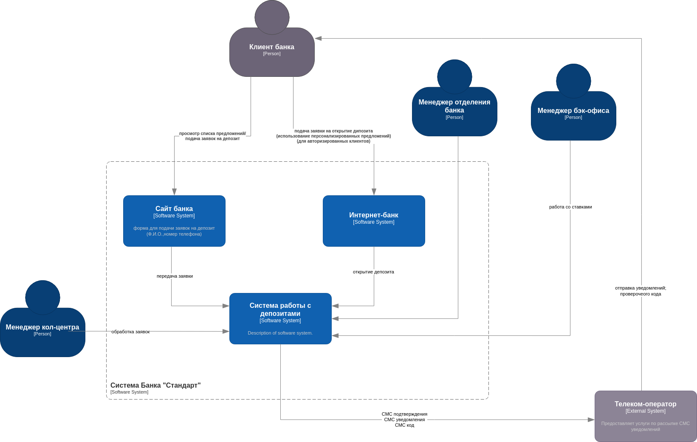
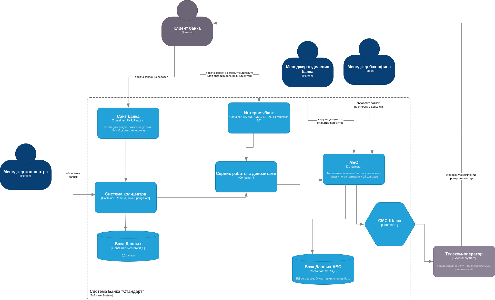

### **Название задачи:**     
Концептуальная архитектура открытия депозитов для MVP 
### **Автор:** 
- Команда цифровой трансформации розничного бизнеса
- IT-отдел
### **Дата:**
2025-06-01
### **Функциональные требования**

|**№**|**Действующие лица или системы**|**Use Case**|**Описание**|
|---|---|---|---|
| 1. | Клиент, Cайт | Заявка на депозит | 1. Клиент подаёт заявку на депозит, оставив свой номер телефона и Ф. И. О.; 2. Заявка попадает в систему кол-центра.|
| 2. | Кол-центр, Клиент | Обработка заявки | 1. Менеджер изучает заявку; 2. Менеджер кол-центра осуществляет звонок клиенту; 3. Менеджер может предложить особые условия|
| 3. | Новый клиент, Отделение банка | Идентификация | Клиент приходит в отделение с документами. |
| 4. | Авторизованный клиент, Интернет-банк | Открытие депозита | 1. Клиент видит список доступных депозитов с актуальными ставками и персонализированные ставки лично для него 2. Клиент указывает счёт, продукт и сумму депозита, -> подаёт заявку на открытие депозита; 3. Клиент подтверждает операцию с помощью СМС-кода.|
| 5. | Менеджер бэк-офиса | Подтверждение условий депозита | 1. Менеджер проверяет ставку и заявку в АБС; 2. Подтверждает оформление. |
| 6. | Бэк-офис (кредитный отдел) | Работа со ставками | Сотрудники обновляют ставки в XLS или в централизованной системе хранения ставок. |
|||||
### **Нефункциональные требования**

|**№**|**Требование**|
|---|---|
| 1 | Защита трафика (HTTPS, шифрование) для сайта и интернет-банка |
| 2 | Высокая доступность сервисов: 99.9%, работа 24/7, резервный ЦОД|
| 3 | Быстрый отклик интерфейсов (< 1 секунды) |
| 4 | Использование существующих технологий: MS SQL, Oracle, (Kafka в перспективе)|
| 5 | Минимизация нагрузки на АБС, исключение прямого доступа из интернет-банка|
| 6 | Возможность масштабирования сервисов: горизонтальное для интернет-банка, вертикальное для АБС |
| 7 | Совместимость с платформами разработки, наличие внутренней экспертизы |
| 8 | Разработка документации для дальнейшего расширения системы |
|||
### **Решение**

Диаграмма контекста:

Диаграмма контейнеров:

Причины принятия решений:
- Минимальная нагрузка на АБС — никаких прямых запросов из ИБ
- Возможность миграции интернет-банка на микросервисную архитектуру через отдельный сервис подачи заявок
- Сервисы могут быть развернуты в разных ЦОД и масштабироваться независимо
- Использование существующих технологий снижает затраты и риски

### **Альтернативы**

- Прямая интеграция интернет-банка с АБС: отказались из-за перегрузки и риска недоступности
- Использование внешнего сервиса для СМС: отклонено по причине затрат и контроля
- Ставки хранятся в Excel: текущий подход, но будет заменён централизованным сервисом

**Недостатки, ограничения, риски**

- Ручная обработка заявок снижает автоматизацию на этапе MVP
- Требуется защита персональных данных: чувствительный трафик
- Возможны задержки при ручной обработке заявок
- Несовместимость Kafka с текущим интернет-банком ограничивает использование очередей
- При отсутствии резервного ЦОД или его неполной готовности теряется устойчивость
- Потенциальные проблемы с производительностью при росте клиентской базы

