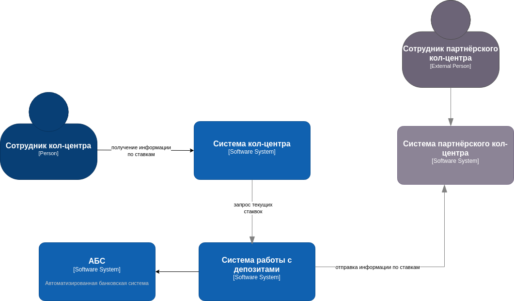
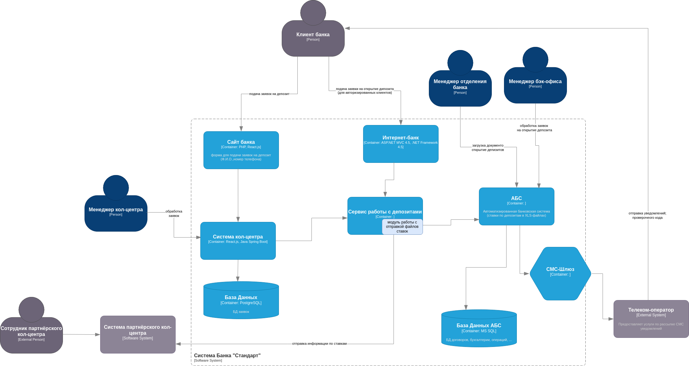

### **Название задачи:**
Расширение архитектуры MVP для учёта потребностей кол-центра и партнёрского кол-центра 
### **Автор:**
Команда цифровой трансформации
### **Дата:**
2025-06-02
### **Функциональные требования**
Опишите здесь верхнеуровневые Use Cases. Их нужно оформить в виде таблицы с пошаговым описанием:

|**№**|**Действующие лица или системы**|**Use Case**|**Описание**|
|---|---|---|---| 
| 1. | Сотрудник кол-центра | Просмотр актуальных ставок | Получение информации о текущих ставках через внутреннюю систему |
| 2. |Партнёрский кол-центр |Получение ставок| Периодическое получение файла с актуальными ставками из банка |
| 3. | Сервис работы с депозитами | Экспорт ставок | Генерация и экспорт файла ставок для внешнего кол-центра |
|||||

### **Нефункциональные требования**
Опишите здесь нефункциональные требования и архитектурно значимые требования.

|**№**|**Требование**|
|---|---|
| 1. | Ставки должны быть доступны для просмотра кол-центром в реальном времени |
| 2. | Партнёрский кол-центр должен получать ставки не реже 1 раза в день |
| 3. | Формат файла должен быть простым для обработки: CSV или XLSX |
| 4. | Защита чувствительных данных при экспорте — контроль доступа, архивирование, пароли |
| 5. | Не использовать API-запросы со стороны партнёра, только отправка файла |
|||
### **Решение**

Диаграммы контекста для текущеё задачи:

Диаграмма контейнеров:

**Логика принития решений:**
- Минимизация изменений и переиспользование:
	- В качестве основы выбрана существующая система работы с дипозитами (из задания 3) — её можно доработать без запуска нового проекта.
	- В интерфейс кол-центра добавляется функциональность только чтения, что снижает риски ошибок и издержки.

- Ограничения партнёрского кол-центра:
	- API, SFTP, FTP недоступны — это исключает полноценную интеграцию.
	- Выбран простой и надёжный механизм: регулярная выгрузка файла в CSV/XLSX-формате, который партнёр может легко обработать.

- Учет безопасности и актуальности:
	- Все выгрузки защищаются (пароль, архивирование), чтобы соответствовать требованиям по защите ПДн.
	- Используется планировщик заданий (cron или аналог) для регулярности выгрузки и снижения человеческого фактора.

- Скорость и удобство для внутренних сотрудников:
	- Для операторов кол-центра — реалтайм-доступ к ставкам, но в режиме только чтения, без возможности правок.

- Совместимость с IT-ландшафтом:
	- Используются поддерживаемые технологии: MS SQL / Oracle, .NET / Java, планировщики на серверной стороне (например, Windows Task Scheduler или Linux cron).

### **Альтернативы**

- Передача ставок по API: невозможна из-за ограничений у партнёра
- Создание отдельной базы ставок для партнёра: избыточно и сложно в поддержке
- Интеграция через FTP: не поддерживается у партнёра

**Недостатки, ограничения, риски**

- Необходимость ручного процесса или полуавтоматизации (отправка файла)
- Возможные задержки в обновлении файла ставок (если не автоматизировано)
- Требуется контроль версий и актуальности ставок для партнёра
- Повышенные требования к безопасности при передаче файла

